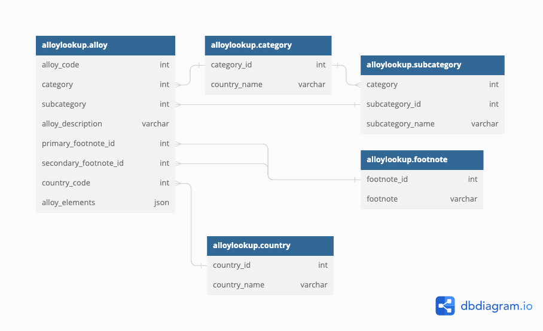

[Link to deployed site](https://pp4-alloy-caddy.herokuapp.com/)

**Project Overview**

AlloyCaddy is a real-world application, as requested by a client of mine.

The app's purpose is to serve as a metal alloy lookup tool for traders in the metals sector.


---
## Table of Contents
1. [**UX**](#ux)
    - [**User Stories**](#user-stories)
    - [**Wireframes**](#wireframes)
    - [**Database Schema**](#database-schema)
3. [**Features**](#features)
    - [**Existing Features**](#existing-features)
    - [**Features Left to Implement**](#features-left-to-implement)
4. [**Technologies Used**](#technologies-used)
    - [**Version Control**](#version-control)
    - [**Hosting**](#hosting)
5. [**Testing**](#testing)
    - [**Code Validation**](#code-validation)
    - [**Automated Testing**](#automated-testing)
    - [**Manual User Testing**](#manual-user-testing)
    - [**Interesting Bugs Or Problems**](#interesting-bugs-or-problems)
6. [**Deployment**](#deployment)
    - [**Local Deployment**](#local-deployment)
    - [**Remote Deployment**](#remote-deployment)
7. [**Credits**](#credits)
    - [**Content**](#content)
    - [**Acknowledgements**](#acknowledgements)
---

The frontend was built using HTML, CSS and JavaScript.
The backend was built using Python, Django, SQLite3 and PostgreSQL.

## UX
Although there is quite a lot going on behind the scenes, the user can focus on finding a relevant alloy or alloys, by simply entering a search term. This can contain an alloy code, full or partial name, base metal, country, element names, symbols, etc.

Menu items and record management controls are accessible, based on the logged in user's status:

- Customers can only search for, and view alloy details
- Admins can create, update and delete all aspects of alloy records

### User Stories
"**_As a user, I can..._**"
- register for a new account
- log into my existing account
- fill in a search form with flexible search terms
- view alloy categories and subcategories
- view related alloy notes and descriptions
- view alloy elements and compounds, with the relevant proportions 

"**_As the app owner, I can..._**"
- send new users an automated welcome email after registration
- help users reset their passwords, using automation
- have full CRUD control over alloy details, categories, subcategories, notes and countries


### Wireframes
For wireframes I used good old pen and paper. Links to the sketches are below:
- 
- 
- 
- 

### Database Schema
Based on a spreadsheet from the client, I created a database schema using [dbdiagram.io](https://dbdiagram.io) The database schema can be viewed using the link below:


##### [back to top](#table-of-contents)
---

## Features
### Existing Features

#### Alloy view & search is the main page of the application
- **Navigation**
    - Regular registered users can see links for alloy viewing/searching and logging out
    - Admin users can see links to alloys, categories, subcategories, footnotes and countries - as well as the relevant add, edit & delete buttons
- **Alloy Table** - Each table row displays the basic details of an alloy, along with a button for displaying further information in a modal window. The end of the row also display the edit and delete buttons to admins.

#### Categories, Subcategories, Footnotes & Countries
- **Layout & Design** - The same table layout is used, in order to keep the design consistent and fimiliar
- **Edit and Delete** - Allows admins to either amend or delete items.

#### Logout
- Users can log out of their account and will be redirected to the login page.

#### Error Pages
-  Included are custom error handlers for 400, 403, 404 and 500 errors, with the option to navigate back to the desired section of the app. 

### Remaining Features to Implement
- **Bulk-Import Data** - At the moment, the database is populated with manually entered sample data. As there are thousands of alloys listed in the spreadsheet, the data should be normalised and functionality for importing created.
- **Display On Mobile** - HTML tables are notorious for being hard to implement on smaller screens - even with Bootstrap's table-responsive class. The next iteration of the app will address this by using a different method of data display - likely react.js.

##### [back to top](#table-of-contents)
---
## Technologies Used
- [**HTML**](https://developer.mozilla.org/en-US/docs/Web/Guide/HTML/HTML5)
    - The project uses **HTML** to create the pages and content of the app.

- [**CSS**](https://developer.mozilla.org/en-US/docs/Web/CSS/CSS3)
    - The project uses **CSS** to apply the custom styles to the app.

- [**Bootstrap**](https://getbootstrap.com/)
    - The project uses the **Bootstrap** framework for the majority of the layout and styling.

- [**Python**](https://www.python.org/)
    - The project uses **Python** as the back-end programming language, using the Django Framework.

- [**Django**](https://www.djangoproject.com/)
    - **Django** was used for creating the app. 

- [**Font Awesome**](https://fontawesome.com/)
    - **Font Awesome** is used for the edit and delete icons.

- [**SQLite**](https://www.sqlite.org/index.html)
    - The project uses **SQLite** as the Database for  local development.

- [**PostgreSQL**](https://www.postgresql.org/)
    - The project uses [ElephantSQL's](https://api.elephantsql.com/) **PostgreSQL** relational database for the deployed version of the app.

- [**SendGrid API**](https://stripe.com/gb)
    - **SendGrid** is used to send the New User Welcome and Password Reset emails.

- [**GitPod**](https://gitpod.io/)
    - I've used **GitPod** as the development environment when writing the code for the app.

### Version Control
- [**Git**](https://git-scm.com/)
    - **Git** is used as a version control system throughout the building of this app.

- [**GitHub**](https://github.com/)
    - I use **GitHub** as a remote repository linked to Heroku when committing and pushing updates and changes.

### Hosting
- [**Heroku**](https://www.heroku.com/)
    - The deployed version of the app is hosted on **Heroku**.

##### [back to top](#table-of-contents)
---

## Testing

### Code Validation
- [W3C HTML Validator tool](https://validator.w3.org/#validate_by_input) was used to validate all HTML code.
    - As W3C doesn't validate the Django Template HTML correctly, the validator remains showing some errors, but these are specific to the W3C compatibility with Django Templates. All standard HTML validates successfully.
- [W3C CSS Validator tool](https://jigsaw.w3.org/css-validator/#validate_by_input) was used to validate all CSS code, excluding Bootstrap.
- [Pep8 Online tool](http://pep8online.com/) was used to validate my Python syntax.

### Automated Testing
The [Coverage](https://pypi.org/project/coverage/) library was used throughout testing to help keep track of how much of my code was covered by the tests. The tests provide an overall coverage of 83% when including all files including files generated by Django.

You can generate a coverage report by installing the package using `pip3 install coverage`
- Run `coverage run manage.py test`
- Then `coverage html` to generate the report
- The report can be viewed in a browser by opening the `index.html` file from inside the `htmlcov` folder.

- **Automated Tests Included**
**Form Tests:**

**CreateAlloyForm & UpdateAlloyForm**
- Alloy Code & Alloy Description ARE required
- Country Code, Primary & Secondary Footnotes, Category & Subcategory fields are NOT required
- Form fields are explicit in the form meta class


**CreateCategoryForm & UpdateCategoryForm**
- Category Id & Category Name fields ARE required
- Form fields are explicit in the form meta class


**CreateSubCategoryForm & UpdateSubCategoryForm**
- Subcategory Id & Subcategory Name fields ARE required
- Parent category field is NOT requires
- Form fields are explicit in the form meta class


**CreateFootNoteForm & UpdateFootNoteForm**
- Footnote Id & Footnote fields ARE required.
- Form fields are explicit in the form meta class.


**CreateCountryForm & UpdateCountryForm**
- Country Id & Country Name fields ARE required.
- Form fields are explicit in the form meta class.


**RegisterUserForm**
- Username, Email, Password1 & Password2 fields ARE required.
- Form fields are explicit in the form meta class.


**Views Tests:**
- User Login successful - response 200
- Admin Login successful - response 200
- Loading Alloy List after Login

**Loading the following pages:**
- Alloy Search page
- Alloy List page
- Categories List
- Subcategories List
- Add Alloy
- Update Alloy
- Delete Alloy
- Add Category
- Update Category
- Delete Category
- Add Subcategory
- Update Subcategory
- Delete Subcategory
- Add Footnote
- Update Footnote
- Delete Footnote
- Add Country
- Update Country
- Delete Country


##### [back to top](#table-of-contents)
---

## Deployment
- For version control, I used GitHub
- ElephantSQL for hosting the PostgreSQL database
- Heroku as the host for the deployed version of the app

**Create a Database on ElephantSQL**

1. Click on "Create New Instance"
2. Enter the new database name and select a plan
3. Select a region and datacenter
4. Review/confirm and click "Create Instance"
5. From the database details, copy the URL

I deployed to Heroku following these steps:

1. Create an app in Heroku using a unique name

2. Update the `env.py` file within my local workspace with the `DATABASE_URL` details created earlier, and the `settings.py` to connect to the database using the `dj_database_url` package.

5. Run the `python manage.py makemigrations`, `python manage.py migrate`, `python manage.py createsuperuser` commands to migrate the models into ElephantSQL Postgres and create a new super user in the new PostgreSQL database.

6. Go to the **Settings** tab in Heroku and click on the **Reveal Config Vars** button.

7. Add the SendGrid and Database URL values as required.

KEY | VALUE
--- | -----
DATABASE_URL | link to db |
SENDGRID_API_KEY | sendgrid API Key |

8. On the **Deploy** tab in Heroku, connect the Heroku App to the GitHub repository and select **Enable Automatic Deployment** as the deployment method.

11. Ensure `settings.py` references the correct Environment Variables for the Database Connections.


12. Update the `settings.py` file with the relevant configuration for static and media file storage.

13. Update the `settings.py` file with the required SendGrid email settings.

14. Confirm the correct API values in the `sendgrid.env` file.

15. Confirm that `sendgrid.env` is included in `.gitignore`

13. Run the `python manage.py collectstatic` command to push the static files to Heroku.

14. Created a requirements.txt file using the following command in the terminal window:
    ```pip3 freeze --local > requirements.txt```

15. Create a Procfile using the following command in the terminal window:
    ```echo web: gunicorn alloycaddy.wsgi:application > Procfile```

16. Ensure that the Heroku App has an associated Dyno for running the App

16. Run the `git add .`, `git commit -m "<commit-message>"` and `git push` commands to push all changes to my GitHub repository.

The app should be successfully deployed to Heroku.

### Repository Link

Visit the project's GitHub repository:

[GitHub Repository](https://github.com/pieterkdevilliers/priority-tracking)

### Running Code Locally

To run the code locally, you can follow these steps:

1. Go to my [GitHub repository](https://github.com/pieterkdevilliers/priority-tracking)

2. Select Clone from the 'Code' dropdown.

3. Copy the clone URL for the repository under the HTTPs tab.

4. Open 'Git Bash' in your local IDE.

5. Select the directory you want to use for the clone.

6. Use `git clone`, and paste the URL from step 3 above. 
    
    ```git clone https://github.com/USERNAME/REPOSITORY```

7. Press `Enter` to complete the clone process.

9. Install `requirements.txt` using the following command in your Terminal:

    ```pip3 install -r requirements.txt```

10. Run the following command in your Terminal:

    ```python manage.py runserver```

11. Click the `http://` link  or the `Open In Browser` button from the pop-up,to load the project.

12. Migrate the database models and create a super user:

    `python manage.py makemigrations`
    `python manage.py migrate`
    `python manage.py createsuperuser`


This will migrate the models and create your SuperUser account. You should now be able to run the site locally.

 To deploy the site remotely, follow the instructions in the [Deployment](#Deployment) section.

##### [back to top](#table-of-contents)
---

## Credits
#### Resources
These creators and teachers were all helpful through there content at different steps in this project.
- [CodingEntrepreneurs - YouTube ](https://www.youtube.com/@CodingEntrepreneurs) 
- [Dennis Ivy - YouTube ](https://www.youtube.com/@DennisIvy)
- [The Dumbfounds - YouTube ](https://www.youtube.com/@thedumbfounds767)
- [WhiteNoise - Django Library ](https://whitenoise.evans.io/en/latest/)
- [Stack Overflow ](https://stackoverflow.com/)


#### Acknowledgements
- I would like to thank both my brother [Pieter](https://github.com/pieterkdevilliers) for an extra pair of eyes, rubberducking and advice - even while he was on holiday.

##### [back to top](#table-of-contents)
---